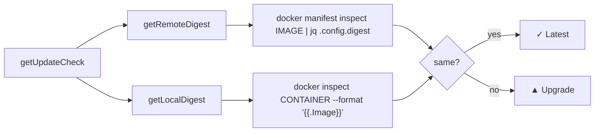

# Docker Digest-Based Update Detection

## Context

The admin dashboard (`src/admin/routes/versions.ts`) displays an update badge for the
AI-EngKit image. The check runs on the `/api/versions/check-update` endpoint, called
when the dashboard page loads. The admin container has Docker socket access and runs
inside a containerized environment (DooD or standalone).

## Problem

The original implementation fetched the GHCR tags list via HTTP:

```typescript
const res = await fetch("https://ghcr.io/v2/tryweb/ai-engkit/tags/list", …);
```

This requires GHCR authentication — unauthenticated requests to `/v2/*/tags/list` return
`401 UNAUTHORIZED`. Not every deployment has a GitHub token configured, causing the check
to fail and the dashboard to display a confusing `? unavailable` badge even when the
running image is the latest release.

## Solution

Replace the HTTP fetch with a Docker-native digest comparison:



### Key code (`src/admin/routes/versions.ts`)

```typescript
import { resolveImageRef } from "../lib/image-ref";

async function getRemoteDigest(): Promise<string | null> {
  const result = await dockerCommand(
    `manifest inspect ${resolveImageRef()} | jq -r '.config.digest'`,
    15_000,
  );
  if (result.exitCode !== 0 || !result.stdout) return null;
  return result.stdout.trim();
}

async function getLocalDigest(): Promise<string | null> {
  const ref = await getAiDevContainerRef();
  const result = await dockerCommand(
    `inspect --format='{{.Image}}' ${ref}`,
    10_000,
  );
  if (result.exitCode !== 0 || !result.stdout) return null;
  return result.stdout.trim();
}
```

These run in parallel via `Promise.all`. If either fails (no network, Docker daemon
down), the check returns `up-to-date` — no failure badge shown.

### Old code removed

- `fetchLatestRemoteVersion()` — HTTP call to GHCR API
- `parseSemver()` / `compareSemver()` / `isPreRelease()` — semver parsing for tags
- `GHCR_TAGS_URL` constant

## Why It Works

- **`docker manifest inspect`** is a metadata-only operation (no layers downloaded),
  fast (~500ms) and works without authentication for public images on GHCR, Docker Hub,
  and most registries.
- **Digest comparison** is authoritative — if the remote `config.digest` matches the
  container's `{{.Image}}`, they are literally the same image. No semver parsing or tag
  comparison needed.
- **Docker daemon access** is already available to the admin container (mounted docker
  socket), so no extra network configuration or credentials are required.

## Side Effects / Tradeoffs

- **`latest` moves only on explicit promotion (2026-08):** the check compares
  against whatever the stable channel points at, so it stays quiet until a release
  is promoted via `.github/workflows/promote.yml`. The ref resolves through
  `resolveImageRef()` (`src/admin/lib/image-ref.ts`), which honors the
  `AI_ENGKIT_VERSION` pin in `/opt/ai-engkit/.env` instead of a hardcoded tag.
- **Version string lost**: The old code could report the exact new version (e.g.
  `v1.5.0 available`). The digest approach only says `New image available` since the new
  version label lives inside the image and can't be read without pulling.
- **No auth → no private registry check**: If the image moves to a private registry, this
  approach will fail (manifest inspect returns 401). Mitigation: the failure is silent
  (assumes up-to-date).
- **Docker daemon dependency**: The check won't work if the admin container loses
  docker.sock access. This is the same requirement as every other admin feature, so not a
  regression.

## Evidence

- `docker manifest inspect ghcr.io/tryweb/ai-engkit:latest` returns valid manifest
  (exit 0, no auth needed).
- `jq` is available at `/usr/bin/jq` inside the admin container.
- Config digest from manifest matches container's `.Image` digest for the same image.
- Build: `bun build --no-bundle server.ts` succeeds with no type errors.

## Related Files

- `src/admin/routes/versions.ts` — `getUpdateCheck()`, `getRemoteDigest()`, `getLocalDigest()`
- `src/admin/lib/docker.ts` — `dockerCommand()`, `getAiDevContainerRef()`
- `docs/knowledge/patterns/version-management-pipeline.md`

## Tags

`version-check`, `update-detection`, `docker-manifest`, `ghcr`, `admin-dashboard`
