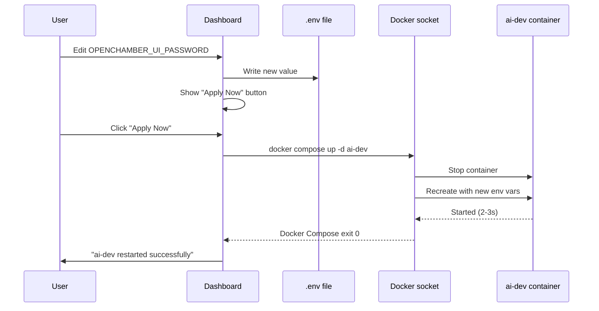
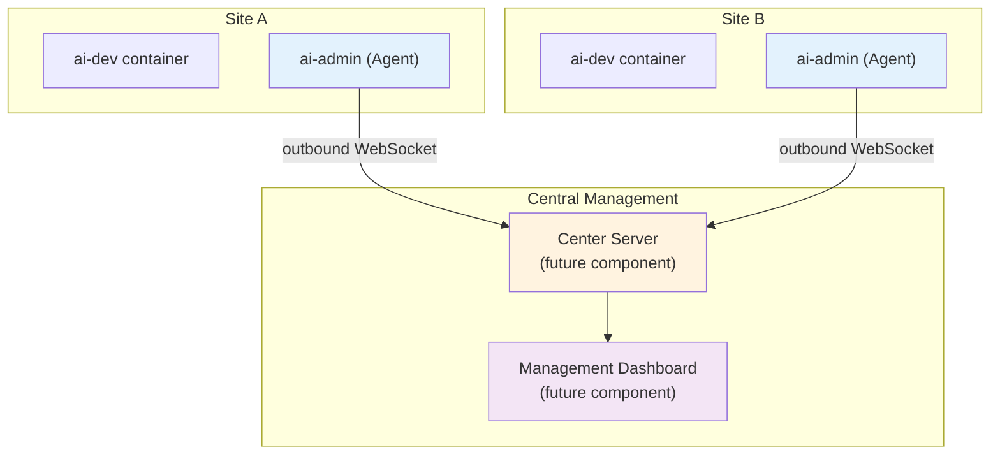

## Context

ai-engkit currently ships a single `ai-dev` container bundling OpenCode engine, OpenChamber Web UI, and a full developer toolchain. Post-install configuration — Git credentials, GitHub/GitLab auth, `.env` tuning, project creation, version upgrades — is exclusively CLI-based, requiring shell access to either the host (`upgrade.sh`) or the container (`gh auth login`, `git config`, etc.).

This design introduces `ai-admin`, a lightweight web dashboard sidecar that runs alongside `ai-dev` in the same Docker image, surfacing these operations through a browser UI.

The constraint: **zero additional image layers**. Everything must run on the bun runtime already present in the image.

## Goals / Non-Goals

**Goals:**
- Provide a web UI for `.env` configuration (read + edit with validation)
- Display pinned component versions from the running image
- Trigger container upgrade (pull + recreate) from the browser with real-time log streaming — replacing the existing `upgrade.sh` CLI script
- Create OpenCode project directories in the workspace volume
- Guide users through GitHub CLI authentication via device-code flow
- Guide users through GitLab CLI authentication via device-code flow
- Allow reading/writing `git config` (user.name, user.email)
- Allow generating and viewing SSH public keys
- Expose a REST API for future centralized Agent consumption
- Secure the dashboard with a configurable password

**Non-Goals:**
- Replace OpenChamber as the primary Web UI (OpenChamber stays the AI interaction surface)
- Provide multi-user RBAC (single-user for Phase 1)
- Manage ai-engkit containers running on remote hosts (future centralized Agent concern)
- Rebuild or restart ai-dev from the dashboard (upgrade replaces the whole container)
- Expose sensitive secrets in plaintext in the dashboard (`.env` values masked by default)

## Decisions

### D1: Bun + Hono as the web framework

**Chosen:** [Hono](https://hono.dev/) on Bun runtime.

Why not alternatives:
- **Go binary**: would require cross-compilation and a separate binary in the image, adding complexity to the build pipeline. Image already has bun.
- **Python Flask/FastAPI**: Python is in the image but bun is lighter for a small HTTP server and has native TypeScript support.
- **Express on Node**: bun can run Express, but Hono is purpose-built for Bun/Deno/Cloudflare Workers and is significantly faster for this use case.

Hono provides built-in JSX/HTML templating, static file serving, and middleware (CORS, auth, logging) — everything needed for the dashboard without pulling in a heavy framework.

### D2: Reuse the same Docker image (no separate build)

**Decision:** `ai-admin` uses the same image as `ai-dev` but overrides both `entrypoint` and `command` to avoid running ai-dev's initialization scripts.

```yaml
ai-admin:
  image: ghcr.io/tryweb/ai-engkit:latest
  entrypoint: ["/usr/bin/tini", "--"]      # 繞過 entrypoint.sh
  command: ["bun", "run", "/opt/admin/server.ts"]  # 只跑 admin server
```

Key detail: overriding `entrypoint` prevents `entrypoint.d/*.sh` from running in the admin container. Only the admin server process starts — no init scripts, no service conflicts.

Rationale:
- Zero additional image layers to pull
- All CLI tools (`gh`, `glab`, `git`) available in the admin container for `docker compose exec` dispatch
- Versions stay in sync with ai-dev — no drift
- Overriding entrypoint keeps ai-admin's lifecycle completely independent from ai-dev

#### Dev vs Production configuration

Following the existing pattern, ai-admin has separate configurations:

**Production (`docker-compose.yml`):**
```yaml
ai-admin:
  image: ghcr.io/tryweb/ai-engkit:latest
  container_name: ai-engkit-admin
  entrypoint: ["/usr/bin/tini", "--"]
  command: ["bun", "run", "/opt/admin/server.ts"]
  ports:
    - "${ADMIN_PORT:-8080}:8080"
  volumes:
    - ./.env:/opt/ai-engkit/.env:rw
    - ./docker-compose.yml:/opt/ai-engkit/compose.yml:rw
    - ./backups:/opt/ai-engkit/backups:rw
    - /var/run/docker.sock:/var/run/docker.sock:ro
  healthcheck:
    test: ["CMD", "curl", "-f", "http://localhost:8080/healthz"]
    interval: 30s
    timeout: 10s
    retries: 3
    start_period: 10s
  restart: unless-stopped
```

**Development (`docker-compose.dev.yml`):**
```yaml
ai-admin:
  build:
    context: .
    dockerfile: Dockerfile
  container_name: ai-engkit-admin-dev
  entrypoint: ["/usr/bin/tini", "--"]
  command: ["bun", "run", "--watch", "/opt/admin/server.ts"]  # --watch 支援 hot reload
  ports:
    - "${ADMIN_DEV_PORT:-8081}:8080"
  volumes:
    - ./src/admin:/opt/admin                    # bind mount 讓 code 即時更新
    - ./.env:/opt/ai-engkit/.env:rw
    - ./docker-compose.yml:/opt/ai-engkit/compose.yml:rw
    - ./backups:/opt/ai-engkit/backups:rw
    - /var/run/docker.sock:/var/run/docker.sock:ro
  restart: unless-stopped
```

Key differences:
| Aspect | Production | Development |
|--------|-----------|-------------|
| Port | `ADMIN_PORT` (default 8080) | `ADMIN_DEV_PORT` (default 8081) |
| Container name | `ai-engkit-admin` | `ai-engkit-admin-dev` |
| Code source | Baked into image | Bind mount `./src/admin:/opt/admin` |
| Hot reload | No | `--watch` flag for Bun |
| Build method | Pull image | Build from Dockerfile |

### D3: Minimal volume mount — orchestration via exec

**Decision:** `ai-admin` mounts four host paths: `.env`, `docker-compose.yml`, `backups/`, and the Docker socket. All configuration operations on the ai-dev container (Git, SSH, gh, glab, project init) are performed via `docker compose exec -T ai-dev <command>` instead of sharing auth/state volumes.

| Mount | Path (inside admin) | Mode | Purpose |
|-------|---------------------|------|---------|
| host `./.env` | `/opt/ai-engkit/.env` | rw | Read and edit environment variable config |
| host `./docker-compose.yml` | `/opt/ai-engkit/compose.yml` | rw | Read compose config for upgrade; update on merge |
| host `./backups/` | `/opt/ai-engkit/backups` | rw | Pre-upgrade backup storage (`.env`, `compose.yml`) |
| `/var/run/docker.sock` | `/var/run/docker.sock` | ro | Execute `docker compose exec` and `docker compose up -d` |

Paths inside admin use `/opt/ai-engkit/` instead of `/workspace/` to avoid conflicting with the user's workspace directory.

Rationale:
- `docker compose exec -T ai-dev <cmd>` runs the command inside ai-dev's environment — gh tokens, git configs, SSH keys are naturally in the right place
- No need to sync auth state between two containers via shared volumes
- Fewer volume mounts = simpler docker-compose.yml and fewer permissions to manage
- ai-admin becomes a pure orchestration layer: "instruct, not touch"

### D4: Device-code flow for GitHub/GitLab auth

**Decision:** Auth configuration uses `gh auth login --web` and `glab auth login` (device-code flow), executed inside ai-dev via `docker compose exec -T`.

Flow:
1. User clicks "Connect GitHub" in the dashboard
2. Server runs `docker compose exec -T ai-dev gh auth login --web --hostname github.com`
3. Captures the device code from the exec'd process's stdout (no TTY allocated, clean text output)
4. Dashboard displays the code and the verification URL
5. User opens the URL in a separate browser tab and enters the code
6. Server polls `docker compose exec -T ai-dev gh auth status` repeatedly until authentication completes
7. Dashboard shows "Connected as <username>"

Key detail: `-T` flag disables pseudo-TTY allocation, ensuring stdout is machine-parseable text.

Same flow applies to GitLab (with hostname support for self-hosted instances).

This avoids the complexity of a full OAuth callback server while providing the same UX as `gh auth login` in the terminal. Using exec means auth tokens are stored directly in ai-dev's gh-config — no volume sharing needed.

### D5: Docker API upgrade engine (replaces upgrade.sh)

**Decision:** `ai-admin` manages the full upgrade lifecycle via Docker API (DooD socket), eliminating `upgrade.sh` as a separate script. The upgrade pipeline is:

```
1. DIGEST COMPARE → docker pull ghcr.io/tryweb/ai-engkit:latest → compare digest with current
2. BACKUP         → cp .env + compose.yml → /opt/ai-engkit/backups/pre-<timestamp>/
3. MERGE .env     → curl .env.example from upstream → append new keys to .env
4. RECREATE       → docker compose -f /opt/ai-engkit/compose.yml up -d --force-recreate ai-dev
5. POLL HEALTH    → poll docker compose ps until ai-dev is "Up" (with timeout + rollback)
6. CLEANUP        → docker image prune -f
```

Steps excluded from the original `upgrade.sh`:
- `check_system` (CPU/AVX check) — hardware doesn't change between upgrades; irrelevant
- `self_update` — upgrade.sh is being eliminated
- `update_compose` — compose.yml is mounted directly; if user wants to update it, they git pull on the host

**Real-time log streaming:** Each step emits structured JSON progress events consumed by the browser via SSE.

**Concurrency guard:** Only one upgrade process allowed at a time. Concurrent requests receive HTTP 409.

**Rollback:** On failure, the admin restores `.env` and `compose.yml` from the backup directory and displays the rollback instructions originally from `show_info()`.

**DoD safety note:** All `docker compose` commands executed by admin target only the `ai-dev` service explicitly:
```
docker compose -f /opt/ai-engkit/compose.yml up -d --force-recreate ai-dev
```
This prevents the admin container from recreating itself mid-upgrade. 
The Docker socket passthrough (`/var/run/docker.sock`) means the admin's compose binary talks to the host Docker daemon using the same compose file and `.env` as the host would — no context confusion.

### D6: Authentication for the dashboard itself

**Decision:** Session-cookie-based auth using HMAC-signed tokens. Password is set via `install.sh` prompt and stored in `.env` as `ADMIN_PASSWORD`.

Mechanism:
- **Password source**: `ADMIN_PASSWORD` env var, prompted during `install.sh` (identical flow to `OPENCHAMBER_UI_PASSWORD`)
- **No static default**: unlike `OPENCHAMBER_UI_PASSWORD=chamber`, admin has no fallback default — `install.sh` **requires** setting it
- **Cookie**: Session cookie (no `Max-Age`, browser close = logout), `HttpOnly`, `SameSite=Lax`
- **Token format**: HMAC-SHA256 signed payload using `ADMIN_PASSWORD` as the secret key — no JWT library needed, Bun's `crypto.subtle.digestSync` suffices
- **No session store**: stateless, token is self-validating
- **Password change**: changing `ADMIN_PASSWORD` in `.env` invalidates all existing cookies on next request (signature mismatch)
- **Brute-force protection**: 5 failed attempts → 3-second delay before retry
- **Logout**: `POST /api/logout` clears the session cookie — user can sign out without closing the browser
- **First-run / setup**: if `ADMIN_PASSWORD` is not set in `.env`, all routes redirect to `/setup`. The setup page presents a password form; on submit, the server writes `ADMIN_PASSWORD` to `.env` (Tier 1 — immediate) and redirects to `/login`. This ensures the dashboard is never accessible without a configured password.

Rationale:
- Matches existing ai-engkit pattern (`OPENCHAMBER_UI_PASSWORD`)
- Session cookie is the most secure option (no persistent token at rest)
- HMAC signing avoids dependency on `jsonwebtoken` or session middleware

### D7: Frontend architecture — minimal JS, server-rendered HTML

**Decision:** Server-rendered HTML with Hono JSX + progressive enhancement via vanilla JS.

Rationale:
- No SPA framework (React/Vue) needed — this is a tool dashboard, not a complex app
- No build step required (Hono JSX compiles at runtime on Bun)
- Simple fetch() calls for API interactions, SSE for log streaming
- Keeps the codebase small and maintainable

### D8: Exec orchestration pattern — command dispatch to ai-dev

**Decision:** All operations that modify ai-dev's state (auth, config, filesystem) are dispatched via `docker compose exec -T ai-dev <command>` rather than running them locally in the ai-admin container or sharing volumes.

#### Operation classification

| Operation | Method | Why exec works |
|-----------|--------|---------------|
| `gh auth login` | `exec -T ai-dev gh auth login --web` | Tokens stored in ai-dev's gh-config directly |
| `glab auth login` | `exec -T ai-dev glab auth login` | Tokens stored in ai-dev's glab-config directly |
| `git config --global` | `exec -T ai-dev git config ...` | Writes to ai-dev's ~/.gitconfig |
| `ssh-keygen` | `exec -T ai-dev ssh-keygen ...` | Keys stored in ai-dev's ~/.ssh/ |
| `mkdir / opencode --new` | `exec -T ai-dev opencode --new ...` | Project created in ai-dev's workspace |
| `gh auth status` | `exec -T ai-dev gh auth status` | Status check in ai-dev's auth context |
| `git config --list` | `exec -T ai-dev git config --list` | Reads ai-dev's gitconfig |
| `ls ~/.ssh/` | `exec -T ai-dev ls ~/.ssh/` | Reads ai-dev's SSH keys |

#### Operations that DON'T use exec

| Operation | Method | Reason |
|-----------|--------|--------|
| `.env` read/write | Direct file I/O (mounted .env) | Writing to host file system |
| Upgrade (pull + recreate) | Docker API via socket (DooD) | Manages full lifecycle — digest compare, backup, pull, recreate, prune |
| `docker compose up -d ai-dev` | Docker socket | Restart ai-dev with new env vars |

#### Why exec is better than volume sharing

| Concern | Volume sharing (old) | exec pattern (new) |
|---------|---------------------|-------------------|
| Auth state sync | gh token must exist in BOTH containers | Token exists only in ai-dev — single source of truth |
| File permissions | SSH keys need correct perms in both containers | SSH keys managed by ai-dev's entrypoint script |
| Mount complexity | 6 named volumes in docker-compose.yml | 2 mounts: .env + docker socket |
| Race conditions | Both containers could write to same volume | Only ai-dev mutates its own state |
| Debugging | Which container has the latest config? | ai-dev is the sole source of truth |

#### Implementation pattern

All exec calls follow a consistent pattern:
1. Admin backend runs `docker compose exec -T ai-dev <command>` via Docker socket
2. Captures stdout for display/parsing
3. Sets a timeout (default 30s) to prevent hung commands
4. Returns structured JSON to the frontend

### D9: Healthcheck — /healthz endpoint for Docker orchestration

**Decision:** Admin exposes a `GET /healthz` endpoint returning `200 OK` with `{"status":"ok"}`, used by Docker's `healthcheck` stanza. No authentication required (it's a liveness probe, not a security boundary).

```yaml
healthcheck:
  test: ["CMD", "curl", "-f", "http://localhost:8080/healthz"]
  interval: 30s
  timeout: 10s
  retries: 3
  start_period: 10s
```

### D10: Unified ai-dev unavailable handling

**Decision:** The frontend checks `/api/status` on page load. If `ai-dev` container is not running, a global banner is shown and all exec-dependent UI sections (auth, SSH, git, projects, upgrade) display a disabled state with the message "ai-dev container is not running".

The `/api/status` response includes a `container_status` field:
```json
{
  "container_status": "running" | "stopped" | "restarting" | "unavailable",
  "uptime_seconds": 12345,
  "restart_count": 0
}
```

## Risks / Trade-offs

| Risk | Mitigation |
|------|------------|
| [R1] **Upgrade recreates the ai-dev container — but ai-admin survives** since it's a separate service. After upgrade, ai-dev restarts with new image; ai-admin keeps running and dashboard stays accessible. | Document that ai-dev may briefly return 502 during restart; ai-admin reports upgrade status via SSE. The `docker compose up -d --force-recreate ai-dev` command targets only ai-dev, never admin itself. |
| [R2] **Write conflicts on shared volumes** — both ai-dev (via entrypoint scripts) and ai-admin (via dashboard) may write to git-config or gh-config simultaneously. | All operations are web-triggered one-at-a-time; ai-dev entrypoint runs only at container start. No concurrent write scenario under normal use. |
| [R3] **Device code timeout** — `gh auth login --web` has a 15-minute window. User may start the flow, walk away, and return to an expired code. | Dashboard shows a countdown timer; expired code prompts a retry with a fresh code. |
| [R4] **Security surface increase** — exposing a Docker-socket-mounted web service expands the attack surface beyond OpenChamber's port. | Dashboard auth is mandatory (no unauthenticated endpoints except login); Docker socket is used only for upgrade execution, not exposed to API callers. |
| [R5] **`.env` editing without validation** — user could enter invalid values (e.g., malformed port, non-numeric BACKUP_RETENTION) and break ai-dev on next restart. | Each `.env` key gets a schema definition (type, allowed values, regex, apply tier) with client-side + server-side validation. |

### .env variable apply tiers

Each known variable has an apply tier that determines what happens after saving:

| Tier | Label | Variables | Apply method | Downtime |
|------|-------|-----------|-------------|----------|
| **1** | Immediate | `ADMIN_PASSWORD` | Read from `.env` on each request (auth middleware) | None |
| **2** | Service restart | `OPENCHAMBER_UI_PASSWORD`, `OPENCODE_SERVER_PASSWORD`, `OPENCODE_PROVIDER`, `OPENCODE_PLUGINS` | `docker compose up -d ai-dev` via Docker socket | ~2-3s (ai-dev only) |
| **3** | Infrastructure | `CHAMBER_PORT`, `WORKSPACE_PATH`, `BACKUP_RETENTION` | Manual: `docker compose down && docker compose up -d` or guided click-through in dashboard | Full downtime |

#### Tier 2 implementation detail

`docker compose up -d ai-dev` is the key insight — it does NOT require `docker compose down`:



The `up -d` (without `down`) is lightweight because:
- Volumes stay mounted and untouched
- Container name and network IP remain stable
- Only the container layer is replaced
- docker compose automatically detects env var changes and recreates affected services

## Remote Agent Architecture

### Model: Agent-initiated connection

The admin dashboard connects **outbound** to a central management server, not the other way around. This is a fundamental architectural decision that inverts the traditional client-server model.



### Why agent-initiated

| Concern | Center-initiated (pull) | Agent-initiated (push) |
|---------|------------------------|----------------------|
| NAT traversal | ❌ Requires public IP or tunnel | ✅ Works behind any NAT |
| Firewall rules | ❌ Needs inbound port open | ✅ Only outbound HTTPS needed |
| Dynamic IP | ❌ Breaks when IP changes | ✅ Agent always knows where Center is |
| TLS termination | ❌ Each agent needs cert | ✅ Center terminates, agent validates |
| Multi-instance scale | ❌ Center must track N addresses | ✅ Center just accepts connections |

### Two-layer design

```
Layer 1: Local REST API (Phase 1 — in scope)
  ─────────────────────────────────────────
  Purpose: Browser dashboard for local management
  Auth: Session cookie (HMAC-signed)
  Endpoints: /api/status, /api/env/*, /api/upgrade, etc.
  Consumer: Human operator via browser at http://localhost:8080

Layer 2: Agent Connection Module (Future Phase — out of scope)
  ─────────────────────────────────────────
  Purpose: Outbound connection to Center Server for remote management
  Transport: WebSocket (wss://) with auto-reconnect
  Auth: TLS mutual authentication or pre-shared token
  Protocol:
    → Agent sends periodic heartbeat + status report
    ← Center sends commands (upgrade, reconfigure, restart)
  Reliability: Exponential backoff reconnect, offline command queue
```

### Phase 1 explicitly excludes Layer 2

The Phase 1 implementation covers only the Local REST API layer. The Agent Connection Module is architecturally planned but not implemented. However, the local API is designed with future compatibility in mind:

- All local API endpoints return structured JSON (not HTML fragments)
- The status endpoint format is designed to be the same payload that the agent heartbeat would carry
- Future agent module can import the same status-gathering functions
